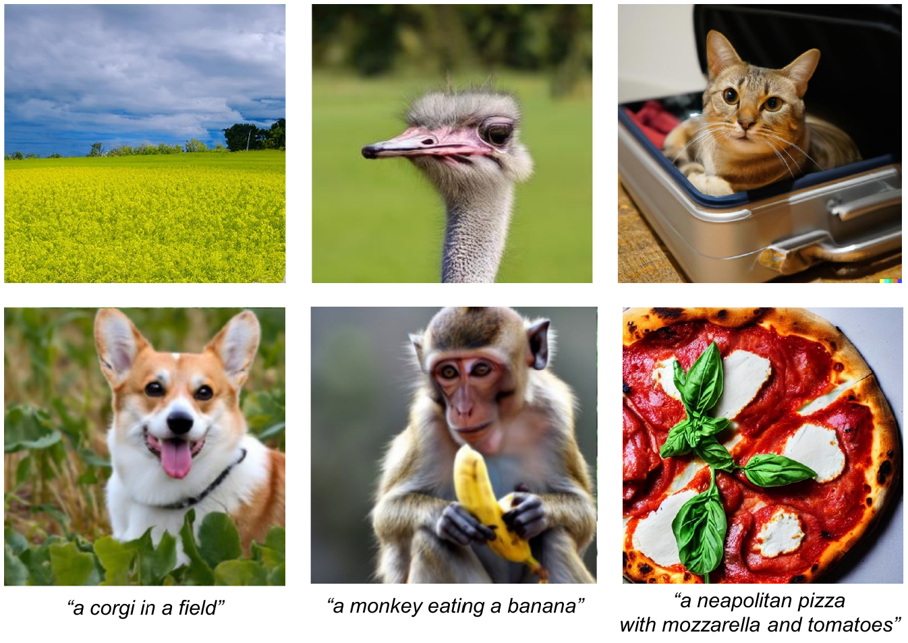

[](https://github.com/grip-unina/DMimageDetection/)
[](https://arxiv.org/abs/2211.00680)
[](https://doi.org/10.1109/ICASSP49357.2023.10095167)
[](https://www.grip.unina.it)

<center></center>

Over the past decade, there has been tremendous progress in creating synthetic media, mainly thanks to the development of powerful methods based on generative adversarial networks (GAN). Very recently, methods based on diffusion models (DM) have been gaining the spotlight. In addition to providing an impressive level of photorealism, they enable the creation of text-based visual content, opening up new and exciting opportunities in many different application fields, from arts to video games. On the other hand, this property is an additional asset in the hands of malicious users, who can generate and distribute fake media perfectly adapted to their attacks, posing new challenges to the media forensic community. With this work, we seek to understand how difficult it is to distinguish synthetic images generated by diffusion models from pristine ones and whether current state-of-the-art detectors are suitable for the task. To this end, first we expose the forensics traces left by diffusion models, then study how current detectors, developed for GAN-generated images, perform on these new synthetic images, especially in challenging social-network scenarios involving image compression and resizing.

## Bibtex 

```
@InProceedings{Corvi_2023_ICASSP,
  author={Corvi, Riccardo and Cozzolino, Davide and Zingarini, Giada and Poggi, Giovanni and Nagano, Koki and Verdoliva, Luisa},
  title={On The Detection of Synthetic Images Generated by Diffusion Models},
  booktitle={IEEE International Conference on Acoustics, Speech and Signal Processing (ICASSP)}, 
  year={2023},
  pages={1-5},
  doi={10.1109/ICASSP49357.2023.10095167}
}
```
